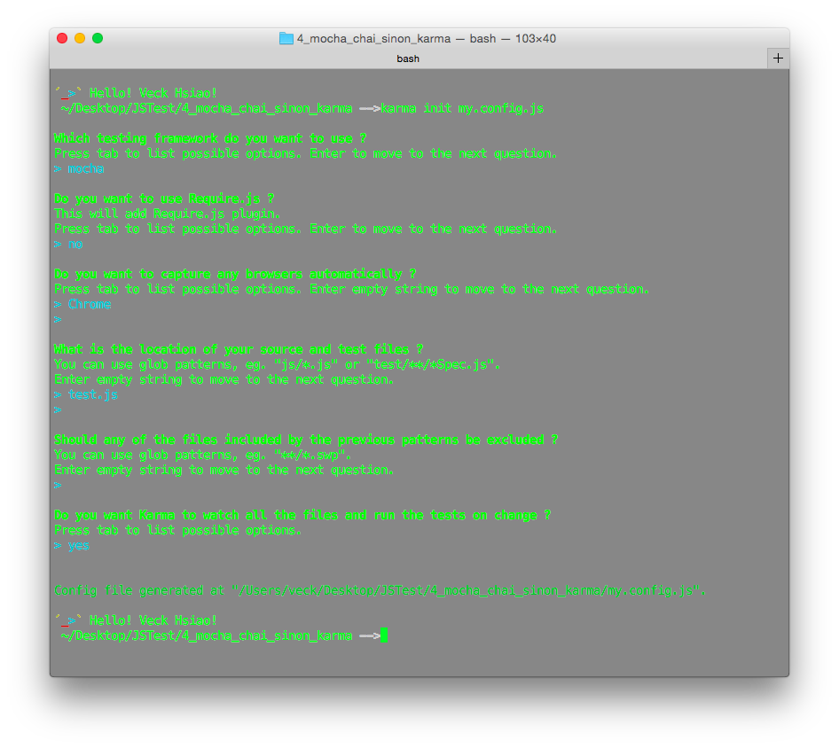
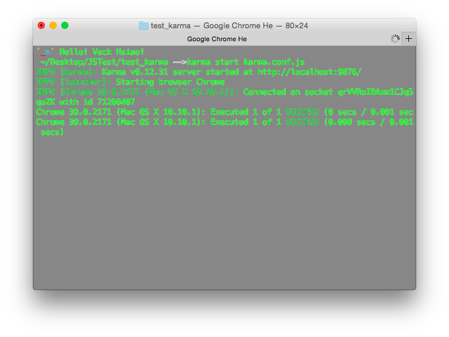

#Install
1. `npm install karma --save-dev` (official instruction, --save-dev will register in dependency package)
2. Karma 用 `npm install -g` 安裝後沒辦法直接輸入使用，要用路徑去執行，但是我改用 nvm 安裝 node.js 所以導致路徑很冗長，所以官網的安裝方式建議是直接針對你要進行測試的專案作個別安裝，這樣路徑也會比較短，我有再 .bashrc 中加入`alias karma='./node_modules/karma/bin/karma'` 

#Intro
karma 主要用來驅動測試，但還可以設定使用的 test framework (test runner: mocha, jasime,...etc.)、測試起始路徑 basePath(如果有設定的話，這個路徑會被加到 files list 中，然後在啟動的瀏覽器中加到 javascript 屬性 src 中作為 prefix)、設定要使用的瀏覽器、哪些檔案要被載入以便存取使用、哪些檔案只觀察變化用、哪些檔案要被排除、瀏覽器啟動時要用 port、預處理器...等等

#Usage
1.建立 config 檔案：`karma init <name>.config.js`


#####my.config.js
```
// Karma configuration
// Generated on Wed Jan 07 2015 16:18:19 GMT+0800 (CST)

module.exports = function(config) {
  config.set({

    // base path that will be used to resolve all patterns (eg. files, exclude)
    basePath: '',


    // frameworks to use
    // available frameworks: https://npmjs.org/browse/keyword/karma-adapter
    frameworks: ['mocha'],


    // list of files / patterns to load in the browser
    files: [
      'test.js'
    ],


    // list of files to exclude
    exclude: [
    ],


    // preprocess matching files before serving them to the browser
    // available preprocessors: https://npmjs.org/browse/keyword/karma-preprocessor
    preprocessors: {
    },


    // test results reporter to use
    // possible values: 'dots', 'progress'
    // available reporters: https://npmjs.org/browse/keyword/karma-reporter
    reporters: ['progress'],


    // web server port
    port: 9876,


    // enable / disable colors in the output (reporters and logs)
    colors: true,


    // level of logging
    // possible values: config.LOG_DISABLE || config.LOG_ERROR || config.LOG_WARN || config.LOG_INFO || config.LOG_DEBUG
    logLevel: config.LOG_INFO,


    // enable / disable watching file and executing tests whenever any file changes
    autoWatch: true,


    // start these browsers
    // available browser launchers: https://npmjs.org/browse/keyword/karma-launcher
    browsers: ['Chrome'],


    // Continuous Integration mode
    // if true, Karma captures browsers, runs the tests and exits
    singleRun: false
  });
};

```
	
2.啟動 karma 來進行測試工作：`karma start <name>.config.js`


#karma-mocha-chai-sinon
##Notice
karma 啟動瀏覽器來執行測試，會找不到 node.js 的 require()，它好像是用 RequireJS 來做為引入 module 的方法

#####stack-overflow


但是 sinon 和 assert 都要用 require 來引用模組啊！儘管用了 require.js ，還是會因為載入慢導致在啟動瀏覽器後來找不到 sinon
```
Chrome 39.0.2171 (Mac OS X 10.10.1) ERROR
  Uncaught Error: Module name "sinon" has not been loaded yet for context: _. Use require([])
  http://requirejs.org/docs/errors.html#notloaded
  at /Users/veck/Desktop/JSTest/5/node_modules/requirejs/require.js:141
```

注意到 npm 上有 karma-chai 和 karma-sinon 這兩個專案，做法都是安裝 plugin 後，只要在 config.js 的 framework 填入 'sinon' 和 'chai'，就可以直接在 test 中 **不用** require 就使用 sinon 和 chai 物件

##karma-sinon
先來解決使用 sinon 的問題：

1. `npm install karma-sinon`
2. 修改 <name>.config.js 的 frameworks：`frameworks: ['mocha', 'sinon']`
3. 修改 test.js，不需要 var sinon = require('sinon') 了，這設計很方便的直接可以用
4. `karma start <name>.config.js` !

```
Chrome 39.0.2171 (Mac OS X 10.10.1) mocha-chai-sino calls the original Functionn FAILED
	ReferenceError: assert is not defined
	    at Context.<anonymous> (/Users/veck/Desktop/JSTest/test_karma/test.js:24:7)
Chrome 39.0.2171 (Mac OS X 10.10.1): Executed 1 of 1 (1 FAILED) ERROR (0.014 secs / 0.003 secs)
```
OK！解決了找不到 require 和 sinon 沒有載入的問題，剩下 assert 

##karma-chai
node.js 原本的 assert module 還是要 require 才能用，想起在學 chai 的時候，chai 的官網有說 chai 也有實現 traditional style assert，因此 assert 可以要用 karma-chai 的 chai 來實現了

1. `npm install karma-chai`
2. 修改 <name>.config.js 的 frameworks：`frameworks: ['mocha', 'sinon', 'chai']`
3. 修改 test.js，不需要 var assert = require('assert') 了
4. `karma start <name>.config.js` !
5. YA!


最後整個 test.js：
```
/* function under test */
function once(fn) {
   var returnValue, called = false;
   return function () {
      if (!called) {
         called = true;
         returnValue = fn.apply(this, arguments);
      }
      return returnValue;
   };
}

/* test code */
describe("karma-mocha-chai-sino", function(){
   it("calls the original Functionn", function () {
      var callback = sinon.spy();// 建立 sinon.spy 物件
      var proxy = once(callback);

      proxy();

      assert(callback.called);
   })
});
```

解到此時，正好休息去洗了個澡，想說既然這 sinon 和 chai 的組合很常在 JavaScript unit test 中用到，應該可以寫個 karma 和 sinon 及 chai 的 plugin，就不用安裝和設定兩次 frameworks 了，先上網查了一下，果然也有人整了一個 karma-sinon-chai，config.js 那邊要用 sinon-chai 這個 framework name

如此一來，就解決 karma 是 browser-based 的問題了！

##Refernce
* [karma plugins](http://karma-runner.github.io/0.12/dev/plugins.html)
* [karma-mocha](https://github.com/karma-runner/karma-mocha)
* [karma-sinon](https://github.com/yanoosh/karma-sinon)
* [karma-chai](https://github.com/xdissent/karma-chai)
* [karma-sinon-chai](https://github.com/kmees/karma-sinon-chai)

